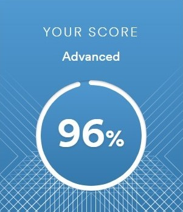

# Rudakov Nikolay

## Contacts

- phone: +7 (771) 331 63 20
- e-mail: nikolayrudakov@mail.ru
- discord: cpt.Jalliko (@Niru26)
- telegram: https://t.me/nirunort

## Shortly about myself

41 year old men trying to radically change his life. Former telecom engineer. Father, husband, son. Living in Almaty, Republic of Kazakhstan.

## Skills 

Related to course:
    
- HTML/CSS
- Bootsrap 3
- JavaScript (Fundamentals)
- C# (Fundamentals)
- Familiar with design tools: Photoshop, AdobeXD, Figma

Non-related to course:

- Blender

## Code example

***Codewar task***

Complete the solution so that it reverses the string passed into it.

Example:

> 'world'  =>  'dlrow'\
> 'it is rose'   =>  'esor si ti'

***My solution***

```
const string = 'word'

function solution(str) {
    let polindrome = [];
    for (let i = 1; i <= str.length; i++) {
        polindrome.push(str[str.length - i]);
    };
    return polindrome.join('');
}
console.log(solution(string));
```

## Education 

Al-Farabi Kazkh State University, Physics department

[Front end developer (in progress)](https://skillbox.ru/)

## Languages

- Russian - native

- English, advanced level according test 

[EFSET](https://www.efset.org/). Test date: 12/11/2022



- TOEFL, 6.2 average score. Passed test 5-6 years ago.


